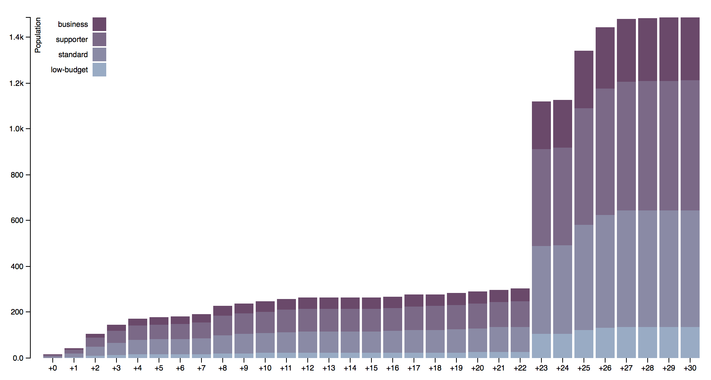

# CCCC - Chaos Communication Camp Counter

Christophe VG (<contact@christophe.vg>)  
[https://github.com/christophevg/cccc](https://github.com/christophevg/cccc)

**Done before we even started ;-)** - It seems the svg data is not allowed to be retrieved outside the original domain, so no live updates are possible, and I'm not going to fetch and update the repository with a fresh cache every hour/day/... Too bad ;-/
  
**BUT...** If you're using Safari (FireFox also blocks it, haven't tested Chrome, but that comes with a command-line switch to disable it it seems, YMMV), you can clone the repo and look at the page locally, because from a local file the same-origin check isn't validated it appears.  
Minimal survival commands:

```bash
$ git clone https://github.com/christophevg/cccc.git
$ cd cccc
$ git checkout gh-pages
$ open index.html
```
**And then things go pitch black :-)** - About 32 hours after the opening of the ticket shop, the target graphs were apparently reformatted to no longer include overlays with numeric values. Coincidence? I don't care :-) But this makes it nearly impossible to extract interesting information from it, so ...

I still had a local copy of one of the early hours, which I've added to the repository. This way to page at least still shows something ;-) Right before the change was introduced, the graph looked like this...



...showing the wonderful take-off of the ticket sales, with about 1400 campers having claimed their spot for this unique event.

**NOTE:** I assume that the camp's organisation is manually updating the orders every 24 hours, which explains the large jump after the first 24 hours :-)

## Introduction

This is just a little bit of fun, trying to compute the number of hackers that
will roam <a href="https://events.ccc.de/camp/2015">CCC15</a>. Based on the
information found in the <a href="https://tickets.events.ccc.de/graph/">target
graphs</a>, I want to try to estimate the number of tickets sold, just to enjoy
the vast growing amount of hackers I will share the camp grounds with.
  
On the other hand, its also a case pro Open Data. It's an example of the not so
cool way of doing things these days. In stead of publishing a json file with
the data (# of tickets per category, # of t-shirts per category) and computing
a rendering on the client-size, the data is mangled into one representation on
the server side, requiring other consumers to reengineer the representation to
an approximation of the original data.
  
I thought hackers would be on the forefront of the openness of where the web is
heading. Seems I'm wrong :-(
  
Finally, it's also an excuse to have a little fun with JavaScript again, after
a long time, exercising a bit for things to come :-)

### visit the dynamic analysis page at [https://christophevg.github.com/cccc](https://christophevg.github.com/cccc) - now only with a static snapshot data set :-)
